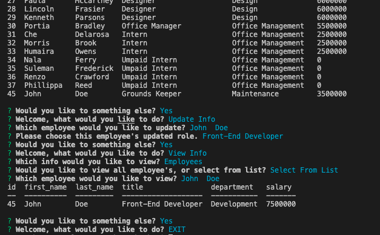

# Employee Tracker  
    
  ## Description  
  This project provides a command line interface to ade a company in tracking their employees, roles, and departments. It allows a user to view the data base in table form. It also gives a user the abbility to both add to and modify the existing data from a terminal window.   
    
      
  ## Deployed Application
      

       
  **[Link to Tutorial](https://drive.google.com/file/d/1u6FkcfDoV5VFZMvxe5-5qnMKbUU08hWs/view)**  
    
      
  ## Table of Contents   
  [Installation](##Installation)  
  [Usage](##Usage)  
  [License](##License)  
  [Contributiing](##Contributing)  
  [Tests](##Tests)  
  [Questions](##Questions)
    
  ## Installation  
  Once cloned onto the users local machine from GitHub, the user will need to install the dependencies of inquirer, mysql, and console.table. This is completed by running the comand `npm i` in the terminal.  
  ## Usage  
  To start the application, the user must type the command `npm start` in the terminal. From there the program will lead the user through a series of prompts to complete the functions they desire.  
  ## License   
  This project is not licensed.    
  ## Contributing  
  There are no guidlines at this time.  
  ## Tests   
  There are currently no testing instructions. Please reach out through either of the links below if it is determined more testing is needed.  
  ## Questions  
  I can be reached at mcbrayer.ian@gmail.com for further information.  
  Please feel free to also check out my work at https://github.com/ihm57511
